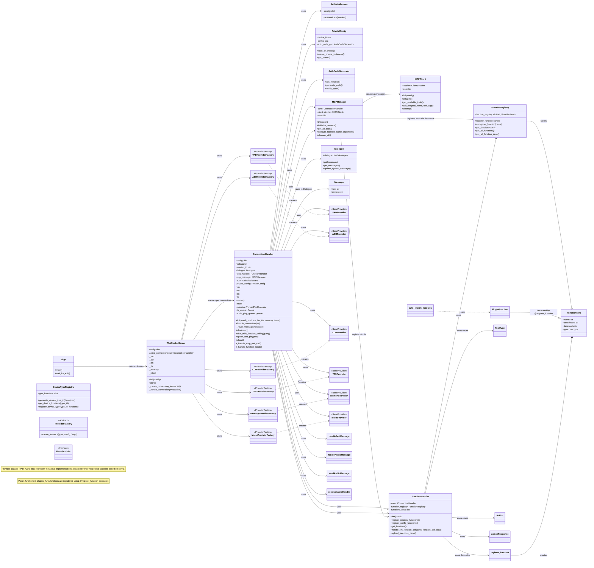

```mermaid
classDiagram
    direction LR

    class App {
        +main()
        +wait_for_exit()
    }

    class WebSocketServer {
        -config: dict
        -active_connections: set~ConnectionHandler~
        -_vad
        -_asr
        -_llm
        -_tts
        -_memory
        -_intent
        +__init__(config)
        +start()
        -_create_processing_instances()
        -_handle_connection(websocket)
    }

    class ConnectionHandler {
        -config: dict
        -websocket
        -session_id: str
        -dialogue: Dialogue
        -func_handler: FunctionHandler
        -mcp_manager: MCPManager
        -auth: AuthMiddleware
        -private_config: PrivateConfig
        -vad
        -asr
        -llm
        -tts
        -memory
        -intent
        -executor: ThreadPoolExecutor
        -tts_queue: Queue
        -audio_play_queue: Queue
        +__init__(config, vad, asr, llm, tts, memory, intent)
        +handle_connection(ws)
        -_route_message(message)
        +chat(query)
        +chat_with_function_calling(query)
        +speak_and_play(text)
        +close()
        #_handle_mcp_tool_call()
        #_handle_function_result()
    }

    class AuthMiddleware {
        -config: dict
        +authenticate(headers)
    }

    class PrivateConfig {
        -device_id: str
        -config: dict
        -auth_code_gen: AuthCodeGenerator
        +load_or_create()
        +create_private_instances()
        +get_owner()
    }

    class AuthCodeGenerator {
        +get_instance()
        +generate_code()
        +verify_code()
    }

    class MCPManager {
        -conn: ConnectionHandler
        -client: dict~str, MCPClient~
        -tools: list
        +__init__(conn)
        +initialize_servers()
        +get_all_tools()
        +execute_tool(tool_name, arguments)
        +cleanup_all()
    }

    class MCPClient {
        -session: ClientSession
        -tools: list
        +__init__(config)
        +initialize()
        +get_available_tools()
        +call_tool(tool_name, tool_args)
        +cleanup()
    }

    class FunctionHandler {
        -conn: ConnectionHandler
        -function_registry: FunctionRegistry
        -functions_desc: list
        +__init__(conn)
        +register_nessary_functions()
        +register_config_functions()
        +get_functions()
        +handle_llm_function_call(conn, function_call_data)
        +upload_functions_desc()
    }

    class FunctionRegistry {
        -function_registry: dict~str, FunctionItem~
        +register_function(name)
        +unregister_function(name)
        +get_function(name)
        +get_all_functions()
        +get_all_function_desc()
    }

    class DeviceTypeRegistry {
        -type_functions: dict
        +generate_device_type_id(descriptor)
        +get_device_functions(type_id)
        +register_device_type(type_id, functions)
    }

    class FunctionItem {
        +name: str
        +description: str
        +func: callable
        +type: ToolType
    }

    class Dialogue {
       +dialogue: list~Message~
       +put(message)
       +get_messages()
       +update_system_message()
    }

    class Message {
        +role: str
        +content: str
    }

    class ProviderFactory {
       <<Abstract>>
       +create_instance(type, config, *args)
    }

    class VADProviderFactory {
       <<ProviderFactory>>
    }
    class ASRProviderFactory {
       <<ProviderFactory>>
    }
    class LLMProviderFactory {
       <<ProviderFactory>>
    }
    class TTSProviderFactory {
       <<ProviderFactory>>
    }
    class MemoryProviderFactory {
       <<ProviderFactory>>
    }
    class IntentProviderFactory {
       <<ProviderFactory>>
    }

    class BaseProvider {
        <<Interface>>
    }

    class VADProvider {
        <<BaseProvider>>
    }
    class ASRProvider {
        <<BaseProvider>>
    }
    class LLMProvider {
        <<BaseProvider>>
    }
    class TTSProvider {
        <<BaseProvider>>
    }
    class MemoryProvider {
        <<BaseProvider>>
    }
    class IntentProvider {
        <<BaseProvider>>
    }


    App --> WebSocketServer : creates & runs
    WebSocketServer --> ConnectionHandler : creates per connection
    WebSocketServer --> VADProviderFactory : uses
    WebSocketServer --> ASRProviderFactory : uses
    WebSocketServer --> LLMProviderFactory : uses
    WebSocketServer --> TTSProviderFactory : uses
    WebSocketServer --> MemoryProviderFactory : uses
    WebSocketServer --> IntentProviderFactory : uses

    ConnectionHandler --> Dialogue : uses
    ConnectionHandler --> FunctionHandler : uses
    ConnectionHandler --> MCPManager : uses
    ConnectionHandler --> AuthMiddleware : uses
    ConnectionHandler --> PrivateConfig : uses
    ConnectionHandler --> AuthCodeGenerator : uses
    ConnectionHandler --> VADProvider : uses
    ConnectionHandler --> ASRProvider : uses
    ConnectionHandler --> LLMProvider : uses
    ConnectionHandler --> TTSProvider : uses
    ConnectionHandler --> MemoryProvider : uses
    ConnectionHandler --> IntentProvider : uses
    ConnectionHandler --> handleTextMessage : uses
    ConnectionHandler --> handleAudioMessage : uses
    ConnectionHandler --> sendAudioMessage : uses
    ConnectionHandler --> receiveAudioHandle : uses
    ConnectionHandler --> FunctionHandler : uses
    ConnectionHandler --> MCPManager : uses

    MCPManager --> MCPClient : creates & manages
    MCPManager --> FunctionHandler : registers tools
    MCPManager --> FunctionRegistry : registers tools via decorator

    FunctionHandler --> FunctionRegistry : uses
    FunctionHandler --> register_function : uses decorator
    FunctionHandler --> ToolType : uses enum
    FunctionHandler --> Action : uses enum
    FunctionHandler --> ActionResponse : uses

    FunctionRegistry --> FunctionItem : stores

    PluginFunction --|> FunctionItem : decorated by @register_function

    VADProviderFactory ..> VADProvider : creates
    ASRProviderFactory ..> ASRProvider : creates
    LLMProviderFactory ..> LLMProvider : creates
    TTSProviderFactory ..> TTSProvider : creates
    MemoryProviderFactory ..> MemoryProvider : creates
    IntentProviderFactory ..> IntentProvider : creates

    ConnectionHandler --> Message : uses in Dialogue

    register_function --* FunctionItem : creates
    auto_import_modules ..> PluginFunction : loads

    note "Provider classes (VAD, ASR, etc.) represent the actual implementations, created by their respective factories based on config."

    note "Plugin functions in plugins_func/functions are registered using @register_function decorator."
```